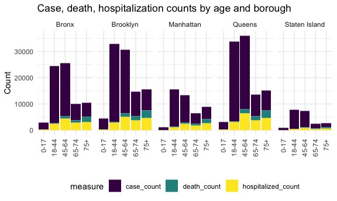
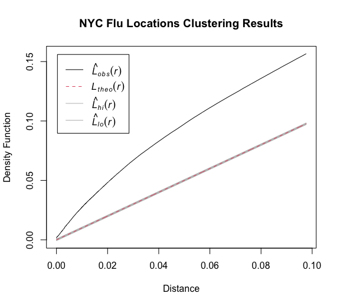
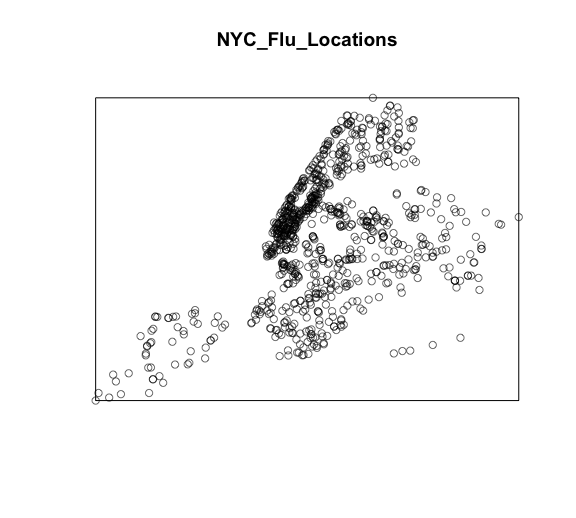

Twindemic Analysis
================

# &lt;&lt;&lt;&lt;&lt;&lt;&lt; Updated upstream

## KNIT FIRST, THEN SAVE, THEN COMMIT, THEN PUSH

## COMMIT FIRST, THEN PULL (FROM OTHER END)

Stashed changes

# Data Cleaning

Loading the COVID data from NYC Health.

``` r
caserate_by_zip = read_csv("./data/caserate-by-modzcta.csv")
vax_by_boro_age = read_csv("./data/coverage-by-boro-age.csv")
vax_by_boro_demo = read_csv("./data/coverage-by-boro-demo.csv")
data_by_day = read_csv("./data/data-by-day.csv")
doses_by_day = read_csv("./data/doses-by-day.csv")
hosprate_by_zip = read_csv("./data/hosprate-by-modzcta.csv")
testrate_by_zip = read_csv("./data/testrate-by-modzcta.csv")
vax_by_zip_adults = read_csv("./data/coverage-by-modzcta-adults.csv")

boroughs_by_sex = read_csv("./data/boroughs-by-sex.csv")
boroughs_by_age = read_csv("./data/boroughs-by-age.csv")
boroughs_by_race = read_csv("./data/boroughs-by-race.csv")

zip_lat_lon = 
  read.table("./data/us_zipcode_lat_lon.txt", sep = ",", header = TRUE) %>% 
  janitor::clean_names() %>% 
  rename(zipcode = zip) %>% 
  filter(zipcode %in% c(10001:11697))
```

From the datasets above, we will likely compare the following pairs:
caserate/hosprate/testrate\_by\_zip; data/doses\_by\_day;
vax\_by\_boro\_age/demo

Cleaning caserate\_by\_zip:

``` r
caserate_by_zipcode = 
  caserate_by_zip %>% 
  janitor::clean_names() %>% 
  select(week_ending, caserate_10001:caserate_10280) %>% 
  pivot_longer(
    caserate_10001:caserate_10280,
    names_to = "zipcode", 
    names_prefix = "caserate_",
    values_to = "case_rate"
  ) %>% 
  mutate(
    week_ending = as.Date(week_ending, "%m/%d/%Y")) 

caserate_by_boro = 
  caserate_by_zip %>% 
  janitor::clean_names() %>% 
  select(week_ending, caserate_city:caserate_si) %>% 
  pivot_longer(
    caserate_city:caserate_si,
    names_to = "boro", 
    names_prefix = "caserate_",
    values_to = "case_rate"
  ) %>% 
  mutate(
    week_ending = as.Date(week_ending, "%m/%d/%Y"),
    boro = recode(boro, "bx" = "Bronx", "bk" = "Brooklyn", "mn" = "Manhattan", "qn" = "Queens", "si" = "Staten Island")) 
```

Cleaning testrate\_by\_zip:

``` r
testrate_by_zipcode = 
  testrate_by_zip %>% 
  janitor::clean_names() %>% 
  select(week_ending, testrate_10001:testrate_10280) %>% 
  pivot_longer(
    testrate_10001:testrate_10280,
    names_to = "zipcode", 
    names_prefix = "testrate_",
    values_to = "test_rate"
  ) %>% 
  mutate(
    week_ending = as.Date(week_ending, "%m/%d/%Y")) 

testrate_by_boro = 
  testrate_by_zip %>% 
  janitor::clean_names() %>% 
  select(week_ending, testrate_city:testrate_si) %>% 
  pivot_longer(
    testrate_city:testrate_si,
    names_to = "boro", 
    names_prefix = "testrate_",
    values_to = "test_rate"
  ) %>% 
  mutate(
    week_ending = as.Date(week_ending, "%m/%d/%Y"),
    boro = recode(boro, "bx" = "Bronx", "bk" = "Brooklyn", "mn" = "Manhattan", "qn" = "Queens", "si" = "Staten Island")) 
```

Cleaning hosprate\_by\_zip:

``` r
hosprate_by_zipcode = 
  hosprate_by_zip %>% 
  janitor::clean_names() %>% 
  select(date, hosprate_10001:hosprate_10280) %>% 
  pivot_longer(
    hosprate_10001:hosprate_10280,
    names_to = "zipcode", 
    names_prefix = "hosprate_",
    values_to = "hosp_rate"
  )

hosprate_by_boro = 
  hosprate_by_zip %>% 
  janitor::clean_names() %>% 
  select(date, hosprate_bronx:hosprate_citywide) %>% 
  pivot_longer(
    hosprate_bronx:hosprate_citywide,
    names_to = "boro", 
    names_prefix = "hosprate_",
    values_to = "hosp_rate"
  ) %>% 
  mutate(
    boro = recode(boro, "bronx" = "Bronx", "brooklyn" = "Brooklyn", "manhattan" = "Manhattan", "queens" = "Queens", "staten_island" = "Staten Island")
  )
```

Cleaning vax\_by\_boro\_age/demo:

``` r
vax_by_boro_age_df = 
  vax_by_boro_age %>% 
  janitor::clean_names() %>% 
  filter(age_group %in% c("'18-24", "'25-34", "'35-44", "'45-54", "'55-64", "'65-74", "'75-84", "'85+") )

vax_by_boro_demo_df = 
  vax_by_boro_demo %>% 
  janitor::clean_names() %>% 
  filter(age_group %in% c("'18-44", "'45-64", "'65+", "All ages") )
```

Cleaning data/doses\_by\_day:

``` r
doses_by_day_df = 
  doses_by_day %>% 
  janitor::clean_names()

data_by_day_df = 
  data_by_day %>% 
  janitor::clean_names() %>% 
  mutate(
    date_of_interest = as.Date(date_of_interest, "%m/%d/%Y")
  )
```

Cleaning vax\_by\_zip\_adults:

``` r
vax_by_zip_adults_df = 
  vax_by_zip_adults %>% 
  janitor::clean_names() %>% 
  rename(boro = borough, zipcode = modzcta)
```

## Exploratory Analysis: COVID-19 Rates & Vaccinations


# Borough by sex, age, and race




# &lt;&lt;&lt;&lt;&lt;&lt;&lt; Updated upstream

> > > > > > > Stashed changes Loading NYC Locations Providing Seasonal
> > > > > > > Flu Vaccinations/ Emergency Department Visits and
> > > > > > > Admissions for Influenza-like Illness/ Census Selected
> > > > > > > Social Characteristics

``` r
flu_vaxx_loc = read_csv("./data/New_York_City_Locations_Providing_Seasonal_Flu_Vaccinations.csv")

census_social = read_csv("./data/censuszip_selected_social_characterisitcs_new.csv")
```

# Data Cleaning 2

Cleaning flu\_vaxx\_loc:

``` r
flu_vaxx_byzipcode =
  flu_vaxx_loc %>%
  janitor::clean_names() %>%
  select(walk_in:zip_code, location) %>%
  filter(borough != "YONKERS") %>%
  group_by(zip_code) %>%
  summarize(n_loc = n()) #to get the total number of vax locations by zipcode

flu_vaxx_byboro =
    flu_vaxx_loc %>%
    janitor::clean_names() %>%
    mutate(borough = toupper(borough)) %>%
    filter(borough != "YONKERS") %>%
    group_by(borough) %>%
    summarize(n_loc_boro = n()) #to get the total number of vax locations by zipcode
```

## Exploratory Analysis

``` r
ggplot(flu_vaxx_byboro, aes(x = borough, y = n_loc_boro, fill = borough)) +
  geom_bar(stat = "identity") +
  labs(
    title = "Distribution of Locations Providing
  Seasonal Flu Vaccinations in NYC",
    x = "Boroughs of NYC",
    y = "Number of Locations Providing Seasonal Flu Vaccinations"
  ) +
  theme(plot.title = element_text(hjust = 0.5))
```


# Social Demo

``` r
# education
cs =
  census_social %>%
  janitor::clean_names() %>% 
  select(name_1, borough, dp02_0060e, dp02_0061e,dp02_0062e,dp02_0063e,dp02_0064e,dp02_0065e, dp02_0066e, dp02_0067e, dp02_0068e) %>%
  filter(borough != "Westchester" ,
  borough != "Suffolk" ,
  borough != "Nassau" ,
  ) %>%
  rename(
  less_than_9th = dp02_0060e,
  hs_no_diploma = dp02_0061e,
  hs_grad = dp02_0062e,
  some_college = dp02_0063e, 
  Associates = dp02_0064e, 
  Bachelors = dp02_0065e, 
  Graduate_or_Professional = dp02_0066e, 
  hs_or_higher = dp02_0067e, 
  bachelors_or_higher = dp02_0068e
  ) %>%
  pivot_longer(
    less_than_9th:bachelors_or_higher,
    names_to = "education", 
    values_to = "Estimates for Population over 25 years"
  ) 
```

``` r
# demographics
demo =
  census_social %>%
  janitor::clean_names() %>% 
  select(name_1, borough, dp02_0124e, dp02_0125e, dp02_0126e, dp02_0127e, dp02_0128e, dp02_0129e, dp02_0130e, dp02_0131e, dp02_0132e,
dp02_0133e, dp02_0134e, dp02_0135e,dp02_0136e, dp02_0137e, dp02_0138e, dp02_0139e, dp02_0140e, dp02_0141e, dp02_0142e, dp02_0143e,  dp02_0144e, dp02_0145e,  dp02_0146e,  dp02_0147e, dp02_0148e,  dp02_0149e,  dp02_0150e) %>% 
filter(borough != "Westchester" ,
  borough != "Suffolk" ,
  borough != "Nassau" ,
  ) %>%
  rename(
  American = dp02_0124e, 
  Arab = dp02_0125e, 
  Czech = dp02_0126e, 
  Danish = dp02_0127e, 
  Dutch = dp02_0128e, 
  English = dp02_0129e, 
  French = dp02_0130e, 
  French_Canadian = dp02_0131e, 
  German = dp02_0132e,
  Greek = dp02_0133e, 
  Hungarian = dp02_0134e, 
  Irish = dp02_0135e,
  Italian = dp02_0136e, 
  Lithuanian = dp02_0137e, 
  Norwegian = dp02_0138e, 
  Polish = dp02_0139e, 
  Portuguese = dp02_0140e, 
  Russian = dp02_0141e, 
  Scotch_Irish = dp02_0142e, 
  Scottish = dp02_0143e,  
  Slovak = dp02_0144e, 
  Subsaharan_African = dp02_0145e,  
  Swedish = dp02_0146e,  
  Swiss = dp02_0147e, 
  Ukrainian = dp02_0148e,  
  Welsh = dp02_0149e,  
  West_Indian = dp02_0150e) %>%
  pivot_longer(
    American:West_Indian,
    names_to = "ancestry", 
    values_to = "Estimates for Population"
  ) 
```

\#Merge data and try to make a leaflet

``` r
merged_vax = left_join(vax_by_zip_adults_df, zip_lat_lon, by = "zipcode")
```

``` r
pal = colorFactor("viridis", NULL)
merged_vax %>%
  leaflet() %>%
  addProviderTiles(providers$CartoDB.Positron) %>%
  addCircleMarkers(~lng, ~lat, radius = 5, color = ~pal(perc_fully), popup = ~perc_fully) %>%
    addLegend("bottomright", pal = pal, values = ~perc_fully,
    title = "Percent fully vaccinated",
    opacity = 1)
```

<div id="htmlwidget-34851f47a247f1466bde" style="width:90%;height:345.6px;" class="leaflet html-widget"></div>
<script type="application/json" data-for="htmlwidget-34851f47a247f1466bde">{"x":{"options":{"crs":{"crsClass":"L.CRS.EPSG3857","code":null,"proj4def":null,"projectedBounds":null,"options":{}}},"calls":[{"method":"addProviderTiles","args":["CartoDB.Positron",null,null,{"errorTileUrl":"","noWrap":false,"detectRetina":false}]},{"method":"addCircleMarkers","args":[[40.750633,40.715775,40.731829,40.68863,40.706027,40.709614,40.713848,40.726399,40.739065,40.742039,40.725581,40.720103,40.734012,40.745224,40.75236,40.755319,40.765823,40.769258,40.758628,40.775921,40.798452,40.798601,40.802381,40.811407,40.776441,40.791763,40.818267,40.825288,40.838815,40.850545,40.867076,40.795455,40.75926,40.812957,40.709278,40.830867,40.858305,40.761915,40.764612,40.775906,40.773361,40.781432,40.708538,40.716921,40.627456,40.630688,40.629885,40.609227,40.596691,40.571768,40.509183,40.551884,40.531346,40.632648,40.545237,40.599263,40.820479,40.837393,40.852779,40.805489,40.81471,40.829881,40.84715,40.862543,40.825867,40.841758,40.847381,40.84328,40.880678,40.867787,40.822615,40.890964,40.869953,40.868093,40.868607,40.88953,40.898868,40.829556,40.81869,40.810549,40.875169,40.746204,40.747155,40.772884,40.762574,40.744634,40.778877,40.762211,40.745115,40.693682,40.649591,40.618779,40.694696,40.701954,40.670747,40.669769,40.621982,40.628147,40.712597,40.662936,40.671078,40.599148,40.662688,40.680768,40.682306,40.643468,40.632667,40.641221,40.69134,40.72779,40.597139,40.577372,40.663046,40.646448,40.616695,40.601293,40.622164,40.677916,40.656546,40.678308,40.60508,40.583949,40.639413,40.70416,40.679171,40.647735,40.768208,40.751452,40.78485,40.786393,40.760471,40.780379,40.764191,40.756574,40.772616,40.745289,40.739634,40.728152,40.730145,40.751718,40.763365,40.765393,40.75169,40.738837,40.726418,40.720934,40.744819,40.724744,40.716748,40.700671,40.694021,40.698095,40.671659,40.657604,40.707917,40.684654,40.676446,40.700272,40.688673,40.673583,40.694062,40.66006,40.715606,40.736425,40.730904,40.721016,40.709766,40.715359,40.698162,40.676808,40.701265,40.675807,40.601278,40.594095,40.590692,40.57827,40.555688],[-73.997177,-73.986212,-73.989181,-74.018244,-74.008835,-74.012954,-74.007755,-73.978631,-73.982255,-74.00062,-73.998078,-74.004903,-74.006746,-73.978297,-73.972493,-73.993114,-73.987169,-73.958751,-73.967948,-73.982607,-73.974428,-73.966622,-73.952681,-73.95306,-73.953509,-73.94397,-73.942856,-73.950045,-73.942836,-73.933983,-73.924312,-73.929655,-73.98986,-73.937376,-74.002562,-73.936218,-73.930549,-73.949962,-73.963122,-73.990358,-73.956216,-73.950013,-74.01665,-74.015066,-74.094407,-74.137776,-74.17413,-74.092575,-74.074866,-74.12595,-74.237785,-74.147646,-74.219857,-74.116148,-74.180443,-74.165748,-73.925084,-73.923437,-73.912332,-73.916585,-73.908593,-73.90812,-73.89868,-73.888143,-73.892942,-73.879571,-73.840584,-73.860389,-73.90654,-73.79992,-73.822239,-73.846239,-73.865746,-73.89973,-73.848133,-73.872662,-73.903328,-73.869336,-73.858474,-73.884367,-73.823817,-73.711478,-73.93975,-73.926295,-73.913447,-73.920201,-73.906769,-73.931528,-73.956928,-73.989693,-73.934371,-73.984826,-73.966286,-73.942358,-73.894209,-73.871372,-74.030324,-73.946324,-73.953098,-73.913029,-73.936336,-73.99609,-73.98674,-73.949316,-73.978099,-73.976046,-73.996669,-74.016862,-73.927879,-73.947605,-73.973428,-73.988706,-73.954219,-73.956649,-74.013047,-73.944493,-73.965105,-74.005154,-74.007355,-73.919936,-73.911721,-73.949096,-73.900664,-73.921139,-73.963804,-73.879477,-73.827403,-73.821031,-73.841279,-73.810864,-73.796371,-73.78123,-73.772775,-73.737845,-73.746526,-73.760586,-73.79449,-73.785019,-73.82703,-73.851822,-73.872374,-73.893243,-73.883638,-73.878535,-73.861526,-73.846151,-73.905156,-73.909639,-73.879601,-73.889433,-73.736216,-73.758986,-73.752568,-73.844804,-73.828212,-73.849548,-73.844443,-73.835971,-73.822918,-73.81773,-73.858626,-73.736012,-73.768471,-73.722376,-73.745661,-73.742245,-73.738653,-73.793071,-73.786893,-73.776425,-73.809605,-73.796622,-73.761651,-73.792896,-73.809749,-73.844762,-73.920663],5,null,null,{"interactive":true,"className":"","stroke":true,"color":["#EFE51C","#8AD547","#3A548C","#F6E620","#8DD645","#F3E61E","#D4E21A","#1F988B","#355E8D","#25AC82","#2E6F8E","#5FC961","#1F9E89","#99D83E","#D0E11C","#FDE725","#E4E419","#1F968B","#A0DA39","#50C46A","#2BB17E","#1FA187","#472A7A","#433E85","#23888E","#27808E","#482374","#3E4A89","#3B518B","#414387","#424186","#20938C","#FAE722","#482475","#33B679","#46327E","#3E4C8A","#2DB27D","#47C06F","#74D055","#91D743","#35B779","#26828E","#31688E","#218E8D","#21A685","#25848E","#23A983","#1F998A","#2FB47C","#472F7D","#453781","#3C4F8A","#37B878","#32648E","#3B528B","#31B57B","#26AD81","#24878E","#287D8E","#2C738E","#375B8D","#29798E","#365C8D","#21918C","#355F8D","#63CB5F","#41BD72","#228D8D","#1E9B8A","#3F4889","#481F70","#33628D","#31678E","#472E7C","#2E6E8E","#1E9C89","#297A8E","#38598C","#3F4788","#424186","#2A768E","#E7E419","#C0DF25","#56C667","#9CD93B","#287C8E","#66CB5D","#A8DB34","#7BD151","#404588","#30698E","#460C5F","#433C84","#3D4E8A","#2F6B8E","#20A386","#460A5D","#443983","#355F8D","#471365","#20928C","#1F958B","#34618D","#2A778E","#228B8D","#46075B","#D8E219","#2D718E","#44BF70","#46337F","#450559","#39558C","#277F8E","#24878E","#443A83","#481B6D","#38578C","#28AE80","#440356","#482072","#32658E","#48196B","#3CBB75","#3FBC73","#7ED34E","#C4E022","#EBE51B","#CCE11E","#59C765","#B8DE29","#3ABA76","#ACDC31","#53C569","#70CF57","#69CD5B","#5CC863","#24AA83","#21908D","#BCDF27","#C8E020","#2C718E","#D8E219","#DCE318","#4DC26C","#238A8D","#B0DD2F","#29AF7F","#2B748E","#26828E","#471063","#472C7A","#470E61","#453581","#20A486","#86D549","#6DCD59","#4AC16D","#82D34C","#3CBB75","#77D153","#482878","#22A785","#1FA188","#B4DE2C","#94D840","#481769","#A4DB36","#2F6C8E","#482677","#1F9F88","#25858E","#440154","#481567","#481C6E","#424086","#DFE318"],"weight":5,"opacity":0.5,"fill":true,"fillColor":["#EFE51C","#8AD547","#3A548C","#F6E620","#8DD645","#F3E61E","#D4E21A","#1F988B","#355E8D","#25AC82","#2E6F8E","#5FC961","#1F9E89","#99D83E","#D0E11C","#FDE725","#E4E419","#1F968B","#A0DA39","#50C46A","#2BB17E","#1FA187","#472A7A","#433E85","#23888E","#27808E","#482374","#3E4A89","#3B518B","#414387","#424186","#20938C","#FAE722","#482475","#33B679","#46327E","#3E4C8A","#2DB27D","#47C06F","#74D055","#91D743","#35B779","#26828E","#31688E","#218E8D","#21A685","#25848E","#23A983","#1F998A","#2FB47C","#472F7D","#453781","#3C4F8A","#37B878","#32648E","#3B528B","#31B57B","#26AD81","#24878E","#287D8E","#2C738E","#375B8D","#29798E","#365C8D","#21918C","#355F8D","#63CB5F","#41BD72","#228D8D","#1E9B8A","#3F4889","#481F70","#33628D","#31678E","#472E7C","#2E6E8E","#1E9C89","#297A8E","#38598C","#3F4788","#424186","#2A768E","#E7E419","#C0DF25","#56C667","#9CD93B","#287C8E","#66CB5D","#A8DB34","#7BD151","#404588","#30698E","#460C5F","#433C84","#3D4E8A","#2F6B8E","#20A386","#460A5D","#443983","#355F8D","#471365","#20928C","#1F958B","#34618D","#2A778E","#228B8D","#46075B","#D8E219","#2D718E","#44BF70","#46337F","#450559","#39558C","#277F8E","#24878E","#443A83","#481B6D","#38578C","#28AE80","#440356","#482072","#32658E","#48196B","#3CBB75","#3FBC73","#7ED34E","#C4E022","#EBE51B","#CCE11E","#59C765","#B8DE29","#3ABA76","#ACDC31","#53C569","#70CF57","#69CD5B","#5CC863","#24AA83","#21908D","#BCDF27","#C8E020","#2C718E","#D8E219","#DCE318","#4DC26C","#238A8D","#B0DD2F","#29AF7F","#2B748E","#26828E","#471063","#472C7A","#470E61","#453581","#20A486","#86D549","#6DCD59","#4AC16D","#82D34C","#3CBB75","#77D153","#482878","#22A785","#1FA188","#B4DE2C","#94D840","#481769","#A4DB36","#2F6C8E","#482677","#1F9F88","#25858E","#440154","#481567","#481C6E","#424086","#DFE318"],"fillOpacity":0.2},null,null,[115.54,92.64,75.43,132.59,93,126.6,106,81.24,75.92,83.7,78.01,89.4,82.29,93.65,104.14,160.72,111.63,80.97,94.26,88.27,84.87,82.88,69.98,71.92,79.8,79.08,68.82,73.7,75.31,72.8,72.3,80.69,140.5,69.17,85.12,70.73,74.01,84.91,87.59,91.48,93.06,86.09,79.11,76.88,80.07,83.12,79.53,83.56,81.85,84.92,70.19,71.22,74.62,86.44,76.28,75.33,85.04,83.74,79.71,79.04,78.39,75.6,78.88,75.84,80.28,75.99,89.54,87.19,80,82.04,73.24,68.72,76.05,76.69,70.08,77.33,82.17,78.95,75.53,73.07,72.3,78.47,113.17,100.54,88.36,93.69,78.97,90.08,95.37,92.03,72.96,76.89,66.09,71.72,74.05,77.03,83,65.83,71.53,75.99,67.05,80.48,80.96,76.04,78.5,79.9,65.38,107.16,78.17,87.38,70.83,65.31,75.47,79.07,79.71,71.57,68.11,75.51,83.88,64.29,68.73,76.42,67.82,87,87.03,92.11,101.69,113.92,103.64,88.89,98.81,86.85,95.46,88.31,90.64,90.5,89.08,83.67,80.12,99,102.48,78.35,107.16,111.01,88.18,79.85,97.15,84.24,78.46,79.36,67.04,69.99,66.34,71.05,83.11,92.44,90.56,87.88,92.41,87,92.01,69.81,83.32,82.74,97.47,93.17,67.4,94.4,77.3,69.54,82.67,79.63,61.35,67.19,68.14,72.03,111.36],null,null,{"interactive":false,"permanent":false,"direction":"auto","opacity":1,"offset":[0,0],"textsize":"10px","textOnly":false,"className":"","sticky":true},null]},{"method":"addLegend","args":[{"colors":["#440154","#440356","#450559","#46075B","#460A5D","#460C5F","#470E61","#471063","#471365","#481567","#481769","#48196B","#481B6D","#481C6E","#481F70","#482072","#482374","#482475","#482677","#482878","#472A7A","#472C7A","#472E7C","#472F7D","#46327E","#46337F","#453581","#453781","#443983","#443A83","#433C84","#433E85","#424086","#424186","#414387","#404588","#3F4788","#3F4889","#3E4A89","#3E4C8A","#3D4E8A","#3C4F8A","#3B518B","#3B528B","#3A548C","#39558C","#38578C","#38598C","#375B8D","#365C8D","#355E8D","#355F8D","#34618D","#33628D","#32648E","#32658E","#31678E","#31688E","#30698E","#2F6B8E","#2F6C8E","#2E6E8E","#2E6F8E","#2D718E","#2C718E","#2C738E","#2B748E","#2A768E","#2A778E","#29798E","#297A8E","#287C8E","#287D8E","#277F8E","#27808E","#26828E","#26828E","#25848E","#25858E","#24878E","#23888E","#238A8D","#228B8D","#228D8D","#218E8D","#21908D","#21918C","#20928C","#20938C","#1F958B","#1F968B","#1F988B","#1F998A","#1E9B8A","#1E9C89","#1F9E89","#1F9F88","#1FA188","#1FA187","#20A386","#20A486","#21A685","#22A785","#23A983","#24AA83","#25AC82","#26AD81","#28AE80","#29AF7F","#2BB17E","#2DB27D","#2FB47C","#31B57B","#33B679","#35B779","#37B878","#3ABA76","#3CBB75","#3FBC73","#41BD72","#44BF70","#47C06F","#4AC16D","#4DC26C","#50C46A","#53C569","#56C667","#59C765","#5CC863","#5FC961","#63CB5F","#66CB5D","#69CD5B","#6DCD59","#70CF57","#74D055","#77D153","#7BD151","#7ED34E","#82D34C","#86D549","#8AD547","#8DD645","#91D743","#94D840","#99D83E","#9CD93B","#A0DA39","#A4DB36","#A8DB34","#ACDC31","#B0DD2F","#B4DE2C","#B8DE29","#BCDF27","#C0DF25","#C4E022","#C8E020","#CCE11E","#D0E11C","#D4E21A","#D8E219","#DCE318","#DFE318","#E4E419","#E7E419","#EBE51B","#EFE51C","#F3E61E","#F6E620","#FAE722","#FDE725"],"labels":["61.35","64.29","65.31","65.38","65.83","66.09","66.34","67.04","67.05","67.19","67.4","67.82","68.11","68.14","68.72","68.73","68.82","69.17","69.54","69.81","69.98","69.99","70.08","70.19","70.73","70.83","71.05","71.22","71.53","71.57","71.72","71.92","72.03","72.3","72.8","72.96","73.07","73.24","73.7","74.01","74.05","74.62","75.31","75.33","75.43","75.47","75.51","75.53","75.6","75.84","75.92","75.99","76.04","76.05","76.28","76.42","76.69","76.88","76.89","77.03","77.3","77.33","78.01","78.17","78.35","78.39","78.46","78.47","78.5","78.88","78.95","78.97","79.04","79.07","79.08","79.11","79.36","79.53","79.63","79.71","79.8","79.85","79.9","80","80.07","80.12","80.28","80.48","80.69","80.96","80.97","81.24","81.85","82.04","82.17","82.29","82.67","82.74","82.88","83","83.11","83.12","83.32","83.56","83.67","83.7","83.74","83.88","84.24","84.87","84.91","84.92","85.04","85.12","86.09","86.44","86.85","87","87.03","87.19","87.38","87.59","87.88","88.18","88.27","88.31","88.36","88.89","89.08","89.4","89.54","90.08","90.5","90.56","90.64","91.48","92.01","92.03","92.11","92.41","92.44","92.64","93","93.06","93.17","93.65","93.69","94.26","94.4","95.37","95.46","97.15","97.47","98.81","99","100.54","101.69","102.48","103.64","104.14","106","107.16","111.01","111.36","111.63","113.17","113.92","115.54","126.6","132.59","140.5","160.72"],"na_color":null,"na_label":"NA","opacity":1,"position":"bottomright","type":"factor","title":"Percent fully vaccinated","extra":null,"layerId":null,"className":"info legend","group":null}]}],"limits":{"lat":[40.509183,40.898868],"lng":[-74.237785,-73.711478]}},"evals":[],"jsHooks":[]}</script>

``` r
pal = colorFactor("viridis", NULL)
merged_vax %>%
  leaflet() %>%
  addProviderTiles(providers$CartoDB.Positron) %>%
  addCircleMarkers(~lng, ~lat, radius = 5, color = ~pal(perc_partially), popup = ~perc_partially) %>%
    addLegend("bottomright", pal = pal, values = ~perc_partially,
    title = "Percent partially vaccinated",
    opacity = 1)
```

<div id="htmlwidget-6284fe497b7e25e309c0" style="width:90%;height:345.6px;" class="leaflet html-widget"></div>
<script type="application/json" data-for="htmlwidget-6284fe497b7e25e309c0">{"x":{"options":{"crs":{"crsClass":"L.CRS.EPSG3857","code":null,"proj4def":null,"projectedBounds":null,"options":{}}},"calls":[{"method":"addProviderTiles","args":["CartoDB.Positron",null,null,{"errorTileUrl":"","noWrap":false,"detectRetina":false}]},{"method":"addCircleMarkers","args":[[40.750633,40.715775,40.731829,40.68863,40.706027,40.709614,40.713848,40.726399,40.739065,40.742039,40.725581,40.720103,40.734012,40.745224,40.75236,40.755319,40.765823,40.769258,40.758628,40.775921,40.798452,40.798601,40.802381,40.811407,40.776441,40.791763,40.818267,40.825288,40.838815,40.850545,40.867076,40.795455,40.75926,40.812957,40.709278,40.830867,40.858305,40.761915,40.764612,40.775906,40.773361,40.781432,40.708538,40.716921,40.627456,40.630688,40.629885,40.609227,40.596691,40.571768,40.509183,40.551884,40.531346,40.632648,40.545237,40.599263,40.820479,40.837393,40.852779,40.805489,40.81471,40.829881,40.84715,40.862543,40.825867,40.841758,40.847381,40.84328,40.880678,40.867787,40.822615,40.890964,40.869953,40.868093,40.868607,40.88953,40.898868,40.829556,40.81869,40.810549,40.875169,40.746204,40.747155,40.772884,40.762574,40.744634,40.778877,40.762211,40.745115,40.693682,40.649591,40.618779,40.694696,40.701954,40.670747,40.669769,40.621982,40.628147,40.712597,40.662936,40.671078,40.599148,40.662688,40.680768,40.682306,40.643468,40.632667,40.641221,40.69134,40.72779,40.597139,40.577372,40.663046,40.646448,40.616695,40.601293,40.622164,40.677916,40.656546,40.678308,40.60508,40.583949,40.639413,40.70416,40.679171,40.647735,40.768208,40.751452,40.78485,40.786393,40.760471,40.780379,40.764191,40.756574,40.772616,40.745289,40.739634,40.728152,40.730145,40.751718,40.763365,40.765393,40.75169,40.738837,40.726418,40.720934,40.744819,40.724744,40.716748,40.700671,40.694021,40.698095,40.671659,40.657604,40.707917,40.684654,40.676446,40.700272,40.688673,40.673583,40.694062,40.66006,40.715606,40.736425,40.730904,40.721016,40.709766,40.715359,40.698162,40.676808,40.701265,40.675807,40.601278,40.594095,40.590692,40.57827,40.555688],[-73.997177,-73.986212,-73.989181,-74.018244,-74.008835,-74.012954,-74.007755,-73.978631,-73.982255,-74.00062,-73.998078,-74.004903,-74.006746,-73.978297,-73.972493,-73.993114,-73.987169,-73.958751,-73.967948,-73.982607,-73.974428,-73.966622,-73.952681,-73.95306,-73.953509,-73.94397,-73.942856,-73.950045,-73.942836,-73.933983,-73.924312,-73.929655,-73.98986,-73.937376,-74.002562,-73.936218,-73.930549,-73.949962,-73.963122,-73.990358,-73.956216,-73.950013,-74.01665,-74.015066,-74.094407,-74.137776,-74.17413,-74.092575,-74.074866,-74.12595,-74.237785,-74.147646,-74.219857,-74.116148,-74.180443,-74.165748,-73.925084,-73.923437,-73.912332,-73.916585,-73.908593,-73.90812,-73.89868,-73.888143,-73.892942,-73.879571,-73.840584,-73.860389,-73.90654,-73.79992,-73.822239,-73.846239,-73.865746,-73.89973,-73.848133,-73.872662,-73.903328,-73.869336,-73.858474,-73.884367,-73.823817,-73.711478,-73.93975,-73.926295,-73.913447,-73.920201,-73.906769,-73.931528,-73.956928,-73.989693,-73.934371,-73.984826,-73.966286,-73.942358,-73.894209,-73.871372,-74.030324,-73.946324,-73.953098,-73.913029,-73.936336,-73.99609,-73.98674,-73.949316,-73.978099,-73.976046,-73.996669,-74.016862,-73.927879,-73.947605,-73.973428,-73.988706,-73.954219,-73.956649,-74.013047,-73.944493,-73.965105,-74.005154,-74.007355,-73.919936,-73.911721,-73.949096,-73.900664,-73.921139,-73.963804,-73.879477,-73.827403,-73.821031,-73.841279,-73.810864,-73.796371,-73.78123,-73.772775,-73.737845,-73.746526,-73.760586,-73.79449,-73.785019,-73.82703,-73.851822,-73.872374,-73.893243,-73.883638,-73.878535,-73.861526,-73.846151,-73.905156,-73.909639,-73.879601,-73.889433,-73.736216,-73.758986,-73.752568,-73.844804,-73.828212,-73.849548,-73.844443,-73.835971,-73.822918,-73.81773,-73.858626,-73.736012,-73.768471,-73.722376,-73.745661,-73.742245,-73.738653,-73.793071,-73.786893,-73.776425,-73.809605,-73.796622,-73.761651,-73.792896,-73.809749,-73.844762,-73.920663],5,null,null,{"interactive":true,"className":"","stroke":true,"color":["#F6E620","#3ABA76","#4FC36B","#E6E419","#D1E11C","#F2E51D","#E1E418","#1F948C","#27AD81","#6ACD5B","#42BE71","#BBDE27","#63CB5F","#B2DD2D","#EAE51A","#FDE725","#EEE51C","#1F958B","#DDE318","#6ECE58","#25AC82","#2DB27D","#23A983","#6ECE58","#2B748E","#1FA088","#33B67A","#23898E","#21918C","#2B758E","#31688E","#81D34D","#F9E622","#365D8D","#C8E020","#48C16E","#287D8E","#375B8D","#AFDD2F","#45C06F","#52C569","#20928C","#1F9A8A","#3DBC74","#1E9D89","#71CF57","#2EB37C","#21A685","#3E4B8A","#482777","#470D60","#46085C","#414287","#35B779","#470F62","#470F62","#8DD645","#95D840","#9AD93D","#B7DE2A","#89D548","#9DD93B","#CCE11E","#7DD24F","#91D742","#A6DB35","#2C718E","#20928C","#2C728E","#38588C","#424086","#287D8E","#38B977","#5FC961","#31668E","#2D708E","#33638D","#66CC5D","#1E9C89","#85D44A","#481467","#46085C","#D9E319","#20A386","#375A8C","#3F4889","#482072","#29798E","#3FBC73","#5CC863","#26818E","#472B7A","#306A8E","#1F978B","#79D152","#4FC36B","#482374","#355E8D","#2D708E","#C4E022","#25AB82","#46317E","#3C4F8A","#22A785","#1FA187","#3E4989","#46337F","#55C667","#58C765","#25848E","#472D7B","#2E6D8E","#2F6B8E","#31B57B","#450357","#481668","#32658E","#3A548C","#21908D","#2AB07F","#481F70","#414487","#2B748E","#AADC32","#218E8D","#A1DA38","#297A8E","#228B8D","#4CC26C","#481B6D","#443983","#481C6E","#463480","#48186A","#443A83","#471164","#453781","#472F7D","#433D84","#D5E21A","#C0DF25","#404688","#75D054","#28AE80","#482979","#460A5D","#2A778E","#3B518B","#450559","#277F8E","#3C4F8A","#228C8D","#39558C","#440154","#482576","#25848E","#3B528B","#287C8E","#2E6E8E","#414287","#26828E","#25838E","#423F85","#481C6E","#3D4D8A","#34608D","#3C4F8A","#21908D","#1F988B","#1F9F88","#33628D","#24868E","#20A486","#21A685","#443983","#481C6E","#23888E"],"weight":5,"opacity":0.5,"fill":true,"fillColor":["#F6E620","#3ABA76","#4FC36B","#E6E419","#D1E11C","#F2E51D","#E1E418","#1F948C","#27AD81","#6ACD5B","#42BE71","#BBDE27","#63CB5F","#B2DD2D","#EAE51A","#FDE725","#EEE51C","#1F958B","#DDE318","#6ECE58","#25AC82","#2DB27D","#23A983","#6ECE58","#2B748E","#1FA088","#33B67A","#23898E","#21918C","#2B758E","#31688E","#81D34D","#F9E622","#365D8D","#C8E020","#48C16E","#287D8E","#375B8D","#AFDD2F","#45C06F","#52C569","#20928C","#1F9A8A","#3DBC74","#1E9D89","#71CF57","#2EB37C","#21A685","#3E4B8A","#482777","#470D60","#46085C","#414287","#35B779","#470F62","#470F62","#8DD645","#95D840","#9AD93D","#B7DE2A","#89D548","#9DD93B","#CCE11E","#7DD24F","#91D742","#A6DB35","#2C718E","#20928C","#2C728E","#38588C","#424086","#287D8E","#38B977","#5FC961","#31668E","#2D708E","#33638D","#66CC5D","#1E9C89","#85D44A","#481467","#46085C","#D9E319","#20A386","#375A8C","#3F4889","#482072","#29798E","#3FBC73","#5CC863","#26818E","#472B7A","#306A8E","#1F978B","#79D152","#4FC36B","#482374","#355E8D","#2D708E","#C4E022","#25AB82","#46317E","#3C4F8A","#22A785","#1FA187","#3E4989","#46337F","#55C667","#58C765","#25848E","#472D7B","#2E6D8E","#2F6B8E","#31B57B","#450357","#481668","#32658E","#3A548C","#21908D","#2AB07F","#481F70","#414487","#2B748E","#AADC32","#218E8D","#A1DA38","#297A8E","#228B8D","#4CC26C","#481B6D","#443983","#481C6E","#463480","#48186A","#443A83","#471164","#453781","#472F7D","#433D84","#D5E21A","#C0DF25","#404688","#75D054","#28AE80","#482979","#460A5D","#2A778E","#3B518B","#450559","#277F8E","#3C4F8A","#228C8D","#39558C","#440154","#482576","#25848E","#3B528B","#287C8E","#2E6E8E","#414287","#26828E","#25838E","#423F85","#481C6E","#3D4D8A","#34608D","#3C4F8A","#21908D","#1F988B","#1F9F88","#33628D","#24868E","#20A486","#21A685","#443983","#481C6E","#23888E"],"fillOpacity":0.2},null,null,[24.03,7.92,8.41,18.44,11.51,22.75,14.55,7.18,7.69,8.79,8.15,9.92,8.69,9.67,18.71,50.49,21.79,7.2,12.97,8.8,7.67,7.8,7.5,8.8,6.61,7.39,7.89,7.02,7.12,6.63,6.42,9.15,30.27,6.22,10.44,8.36,6.78,6.19,9.65,8.33,8.5,7.14,7.26,8.03,7.34,8.85,7.81,7.46,5.89,5.3,4.71,4.58,5.81,7.9,4.72,4.72,9.36,9.39,9.41,9.75,9.27,9.48,10.81,9.07,9.38,9.57,6.57,7.14,6.6,6.1,5.8,6.78,7.91,8.64,6.41,6.54,6.38,8.73,7.3,9.24,4.8,4.58,12.81,7.41,6.15,5.84,5.22,6.7,8.07,8.62,6.84,5.38,6.46,7.24,8.98,8.41,5.27,6.26,6.54,9.95,7.61,5.58,5.92,7.49,7.4,5.88,5.61,8.54,8.55,6.93,5.41,6.52,6.47,7.86,4.51,4.82,6.4,6.08,7.1,7.78,5.17,5.82,6.61,9.59,7.06,9.49,6.72,7.03,8.38,5.1,5.7,5.14,5.66,5.06,5.74,4.76,5.69,5.53,5.76,11.74,9.94,5.83,8.91,7.76,5.34,4.61,6.69,5.93,4.54,6.82,5.92,7.05,6.09,4.33,5.28,6.93,6,6.74,6.53,5.81,6.85,6.9,5.79,5.14,5.9,6.28,5.92,7.1,7.25,7.38,6.34,6.98,7.42,7.46,5.7,5.14,6.99],null,null,{"interactive":false,"permanent":false,"direction":"auto","opacity":1,"offset":[0,0],"textsize":"10px","textOnly":false,"className":"","sticky":true},null]},{"method":"addLegend","args":[{"colors":["#440154","#450357","#450559","#46085C","#460A5D","#470D60","#470F62","#471164","#481467","#481668","#48186A","#481B6D","#481C6E","#481F70","#482072","#482374","#482576","#482777","#482979","#472B7A","#472D7B","#472F7D","#46317E","#46337F","#463480","#453781","#443983","#443A83","#433D84","#423F85","#424086","#414287","#414487","#404688","#3F4889","#3E4989","#3E4B8A","#3D4D8A","#3C4F8A","#3B518B","#3B528B","#3A548C","#39558C","#38588C","#375A8C","#375B8D","#365D8D","#355E8D","#34608D","#33628D","#33638D","#32658E","#31668E","#31688E","#306A8E","#2F6B8E","#2E6D8E","#2E6E8E","#2D708E","#2C718E","#2C728E","#2B748E","#2B758E","#2A778E","#29798E","#297A8E","#287C8E","#287D8E","#277F8E","#26818E","#26828E","#25838E","#25848E","#24868E","#23888E","#23898E","#228B8D","#228C8D","#218E8D","#21908D","#21918C","#20928C","#1F948C","#1F958B","#1F978B","#1F988B","#1F9A8A","#1E9C89","#1E9D89","#1F9F88","#1FA088","#1FA187","#20A386","#20A486","#21A685","#22A785","#23A983","#25AB82","#25AC82","#27AD81","#28AE80","#2AB07F","#2DB27D","#2EB37C","#31B57B","#33B67A","#35B779","#38B977","#3ABA76","#3DBC74","#3FBC73","#42BE71","#45C06F","#48C16E","#4CC26C","#4FC36B","#52C569","#55C667","#58C765","#5CC863","#5FC961","#63CB5F","#66CC5D","#6ACD5B","#6ECE58","#71CF57","#75D054","#79D152","#7DD24F","#81D34D","#85D44A","#89D548","#8DD645","#91D742","#95D840","#9AD93D","#9DD93B","#A1DA38","#A6DB35","#AADC32","#AFDD2F","#B2DD2D","#B7DE2A","#BBDE27","#C0DF25","#C4E022","#C8E020","#CCE11E","#D1E11C","#D5E21A","#D9E319","#DDE318","#E1E418","#E6E419","#EAE51A","#EEE51C","#F2E51D","#F6E620","#F9E622","#FDE725"],"labels":["4.33","4.51","4.54","4.58","4.61","4.71","4.72","4.76","4.8","4.82","5.06","5.1","5.14","5.17","5.22","5.27","5.28","5.3","5.34","5.38","5.41","5.53","5.58","5.61","5.66","5.69","5.7","5.74","5.76","5.79","5.8","5.81","5.82","5.83","5.84","5.88","5.89","5.9","5.92","5.93","6","6.08","6.09","6.1","6.15","6.19","6.22","6.26","6.28","6.34","6.38","6.4","6.41","6.42","6.46","6.47","6.52","6.53","6.54","6.57","6.6","6.61","6.63","6.69","6.7","6.72","6.74","6.78","6.82","6.84","6.85","6.9","6.93","6.98","6.99","7.02","7.03","7.05","7.06","7.1","7.12","7.14","7.18","7.2","7.24","7.25","7.26","7.3","7.34","7.38","7.39","7.4","7.41","7.42","7.46","7.49","7.5","7.61","7.67","7.69","7.76","7.78","7.8","7.81","7.86","7.89","7.9","7.91","7.92","8.03","8.07","8.15","8.33","8.36","8.38","8.41","8.5","8.54","8.55","8.62","8.64","8.69","8.73","8.79","8.8","8.85","8.91","8.98","9.07","9.15","9.24","9.27","9.36","9.38","9.39","9.41","9.48","9.49","9.57","9.59","9.65","9.67","9.75","9.92","9.94","9.95","10.44","10.81","11.51","11.74","12.81","12.97","14.55","18.44","18.71","21.79","22.75","24.03","30.27","50.49"],"na_color":null,"na_label":"NA","opacity":1,"position":"bottomright","type":"factor","title":"Percent partially vaccinated","extra":null,"layerId":null,"className":"info legend","group":null}]}],"limits":{"lat":[40.509183,40.898868],"lng":[-74.237785,-73.711478]}},"evals":[],"jsHooks":[]}</script>

\#Clustering analysis

``` r
library(maptools)
```

    ## Loading required package: sp

    ## Checking rgeos availability: FALSE
    ## Please note that 'maptools' will be retired by the end of 2023,
    ## plan transition at your earliest convenience;
    ## some functionality will be moved to 'sp'.
    ##      Note: when rgeos is not available, polygon geometry     computations in maptools depend on gpclib,
    ##      which has a restricted licence. It is disabled by default;
    ##      to enable gpclib, type gpclibPermit()

``` r
library(spatstat)
```

    ## Loading required package: spatstat.data

    ## Loading required package: spatstat.geom

    ## Registered S3 method overwritten by 'spatstat.geom':
    ##   method     from
    ##   print.boxx cli

    ## spatstat.geom 2.3-1

    ## 
    ## Attaching package: 'spatstat.geom'

    ## The following object is masked from 'package:patchwork':
    ## 
    ##     area

    ## Loading required package: spatstat.core

    ## Loading required package: nlme

    ## 
    ## Attaching package: 'nlme'

    ## The following object is masked from 'package:dplyr':
    ## 
    ##     collapse

    ## Loading required package: rpart

    ## spatstat.core 2.3-2

    ## Loading required package: spatstat.linnet

    ## spatstat.linnet 2.3-0

    ## 
    ## spatstat 2.2-0       (nickname: 'That's not important right now') 
    ## For an introduction to spatstat, type 'beginner'

``` r
library(sf)
```

    ## Linking to GEOS 3.8.1, GDAL 3.2.1, PROJ 7.2.1

## FLU CLUSTERING

``` r
mydata <- read.csv("./data/NYC_Flu_locations.csv")
NYC_Flu_Locations <- ppp(mydata[,13], mydata[,12], c(-74.23442287,-73.68843386), c(40.51789347,40.90856191))
```

    ## Warning: data contain duplicated points

``` r
plot(NYC_Flu_Locations)
```


\#This is running the K function test

``` r
L <- envelope(NYC_Flu_Locations, Lest, nsim = 10, rank = 2, global = T)
```

    ## Generating 10 simulations of CSR  ...
    ## 1, 2, 3, 4, 5, 6, 7, 8, 9,  10.
    ## 
    ## Done.

\#Plot L function with Main Title and x-/y-axis labels

``` r
plot(L, 
     main = "NYC Flu Locations Clustering Results", 
     ylab = "Density Function",
     xlab = "Distance")
```



## COVID CLUSTERING

``` r
mydata2 <- read.csv("./data/COVID_NYC_locations_1.csv") 
NYC_COVID_Locations <- ppp(mydata2[,6], mydata2[,5], c(-74.23538,-73.71330), c(40.51695749,40.90388332))
```

    ## Warning in ppp(mydata2[, 6], mydata2[, 5], c(-74.23538, -73.7133),
    ## c(40.51695749, : 978 out of 1992 points had NA or NaN coordinate values, and
    ## were discarded

``` r
plot(NYC_COVID_Locations)
```



``` r
L <- envelope(NYC_COVID_Locations, Lest, nsim = 10, rank = 2, global = T)
```

    ## Generating 10 simulations of CSR  ...
    ## 1, 2, 3, 4, 5, 6, 7, 8, 9,  10.
    ## 
    ## Done.

``` r
plot(L, 
     main = "NYC COVID Vaccine Locations Clustering Results", 
     ylab = "Density Function",
     xlab = "Distance")
```


