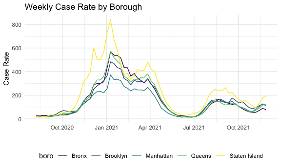
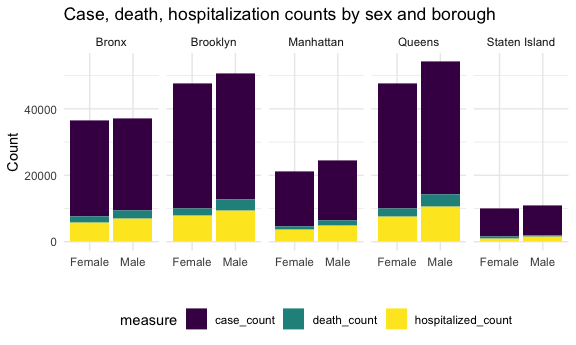

Twindemic Analysis
================

# &lt;&lt;&lt;&lt;&lt;&lt;&lt; Updated upstream

## KNIT FIRST, THEN SAVE, THEN COMMIT, THEN PUSH

## COMMIT FIRST, THEN PULL (FROM OTHER END)

> > > > > > > Stashed changes

# Data Cleaning

Loading the COVID data from NYC Health.

``` r
caserate_by_zip = read_csv("./data/caserate-by-modzcta.csv")
vax_by_boro_age = read_csv("./data/coverage-by-boro-age.csv")
vax_by_boro_demo = read_csv("./data/coverage-by-boro-demo.csv")
data_by_day = read_csv("./data/data-by-day.csv")
doses_by_day = read_csv("./data/doses-by-day.csv")
hosprate_by_zip = read_csv("./data/hosprate-by-modzcta.csv")
testrate_by_zip = read_csv("./data/testrate-by-modzcta.csv")
vax_by_zip_adults = read_csv("./data/coverage-by-modzcta-adults.csv")

zip_lat_lon = 
  read.table("./data/us_zipcode_lat_lon.txt", sep = ",", header = TRUE) %>% 
  janitor::clean_names() %>% 
  rename(zipcode = zip) %>% 
  filter(zipcode %in% c(10001:10280))
```

From the datasets above, we will likely compare the following pairs:
caserate/hosprate/testrate\_by\_zip; data/doses\_by\_day;
vax\_by\_boro\_age/demo

Cleaning caserate\_by\_zip:

``` r
caserate_by_zipcode = 
  caserate_by_zip %>% 
  janitor::clean_names() %>% 
  select(week_ending, caserate_10001:caserate_10280) %>% 
  pivot_longer(
    caserate_10001:caserate_10280,
    names_to = "zipcode", 
    names_prefix = "caserate_",
    values_to = "case_rate"
  ) %>% 
  mutate(
    week_ending = as.Date(week_ending, "%m/%d/%Y")) 

caserate_by_boro = 
  caserate_by_zip %>% 
  janitor::clean_names() %>% 
  select(week_ending, caserate_city:caserate_si) %>% 
  pivot_longer(
    caserate_city:caserate_si,
    names_to = "boro", 
    names_prefix = "caserate_",
    values_to = "case_rate"
  ) %>% 
  mutate(
    week_ending = as.Date(week_ending, "%m/%d/%Y"),
    boro = recode(boro, "bx" = "Bronx", "bk" = "Brooklyn", "mn" = "Manhattan", "qn" = "Queens", "si" = "Staten Island")) 
```

Cleaning testrate\_by\_zip:

``` r
testrate_by_zipcode = 
  testrate_by_zip %>% 
  janitor::clean_names() %>% 
  select(week_ending, testrate_10001:testrate_10280) %>% 
  pivot_longer(
    testrate_10001:testrate_10280,
    names_to = "zipcode", 
    names_prefix = "testrate_",
    values_to = "test_rate"
  ) %>% 
  mutate(
    week_ending = as.Date(week_ending, "%m/%d/%Y")) 

testrate_by_boro = 
  testrate_by_zip %>% 
  janitor::clean_names() %>% 
  select(week_ending, testrate_city:testrate_si) %>% 
  pivot_longer(
    testrate_city:testrate_si,
    names_to = "boro", 
    names_prefix = "testrate_",
    values_to = "test_rate"
  ) %>% 
  mutate(
    week_ending = as.Date(week_ending, "%m/%d/%Y"),
    boro = recode(boro, "bx" = "Bronx", "bk" = "Brooklyn", "mn" = "Manhattan", "qn" = "Queens", "si" = "Staten Island")) 
```

Cleaning hosprate\_by\_zip:

``` r
hosprate_by_zipcode = 
  hosprate_by_zip %>% 
  janitor::clean_names() %>% 
  select(date, hosprate_10001:hosprate_10280) %>% 
  pivot_longer(
    hosprate_10001:hosprate_10280,
    names_to = "zipcode", 
    names_prefix = "hosprate_",
    values_to = "hosp_rate"
  )

hosprate_by_boro = 
  hosprate_by_zip %>% 
  janitor::clean_names() %>% 
  select(date, hosprate_bronx:hosprate_citywide) %>% 
  pivot_longer(
    hosprate_bronx:hosprate_citywide,
    names_to = "boro", 
    names_prefix = "hosprate_",
    values_to = "hosp_rate"
  ) %>% 
  mutate(
    boro = recode(boro, "bronx" = "Bronx", "brooklyn" = "Brooklyn", "manhattan" = "Manhattan", "queens" = "Queens", "staten_island" = "Staten Island")
  )
```

Cleaning vax\_by\_boro\_age/demo:

``` r
vax_by_boro_age_df = 
  vax_by_boro_age %>% 
  janitor::clean_names() %>% 
  filter(age_group %in% c("'18-24", "'25-34", "'35-44", "'45-54", "'55-64", "'65-74", "'75-84", "'85+") )

vax_by_boro_demo_df = 
  vax_by_boro_demo %>% 
  janitor::clean_names() %>% 
  filter(age_group %in% c("'18-44", "'45-64", "'65+", "All ages") )
```

Cleaning data/doses\_by\_day:

``` r
doses_by_day_df = 
  doses_by_day %>% 
  janitor::clean_names()

data_by_day_df = 
  data_by_day %>% 
  janitor::clean_names() %>% 
  mutate(
    date_of_interest = as.Date(date_of_interest, "%m/%d/%Y")
  )
```

Cleaning vax\_by\_zip\_adults:

``` r
vax_by_zip_adults_df = 
  vax_by_zip_adults %>% 
  janitor::clean_names() %>% 
  rename(boro = borough, zipcode = modzcta)
```

## Exploratory Analysis: COVID-19 Rates & Vaccinations





Loading NYC Locations Providing Seasonal Flu Vaccinations/ Emergency
Department Visits and Admissions for Influenza-like Illness/ Census
Selected Social Characteristics

``` r
flu_vaxx_loc = read_csv("./data/New_York_City_Locations_Providing_Seasonal_Flu_Vaccinations.csv")

census_social = read_csv("./data/censuszip_selected_social_characterisitcs.csv")
```

# Data Cleaning 2

Cleaning flu\_vaxx\_loc:

``` r
flu_vaxx_byzipcode =

  flu_vaxx_loc %>%

  janitor::clean_names() %>%

  select(walk_in:zip_code, location) %>%

  filter(borough != "YONKERS") %>%

  group_by(zip_code) %>%

  summarize(n_loc = n()) #to get the total number of vax locations by zipcode

 

flu_vaxx_byboro =

    flu_vaxx_loc %>%

    janitor::clean_names() %>%

    mutate(borough = toupper(borough)) %>%

    filter(borough != "YONKERS") %>%

    group_by(borough) %>%

    summarize(n_loc_boro = n()) #to get the total number of vax locations by zipcode
```

## Exploratory Analysis:

``` r
ggplot(flu_vaxx_byboro, aes(x = borough, y = n_loc_boro)) +

  geom_bar(stat = "identity") +

  labs(

    title = "Distribution of Locations Providing

  Seasonal Flu Vaccinations in NYC",

    x = "Boroughs of NYC",

    y = "Number of Locations Providing Seasonal Flu Vaccinations"

  ) +

  theme(plot.title = element_text(hjust = 0.5))
```


